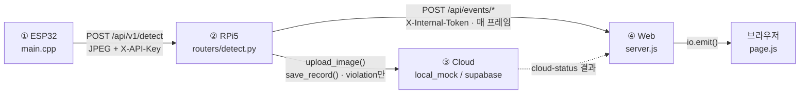
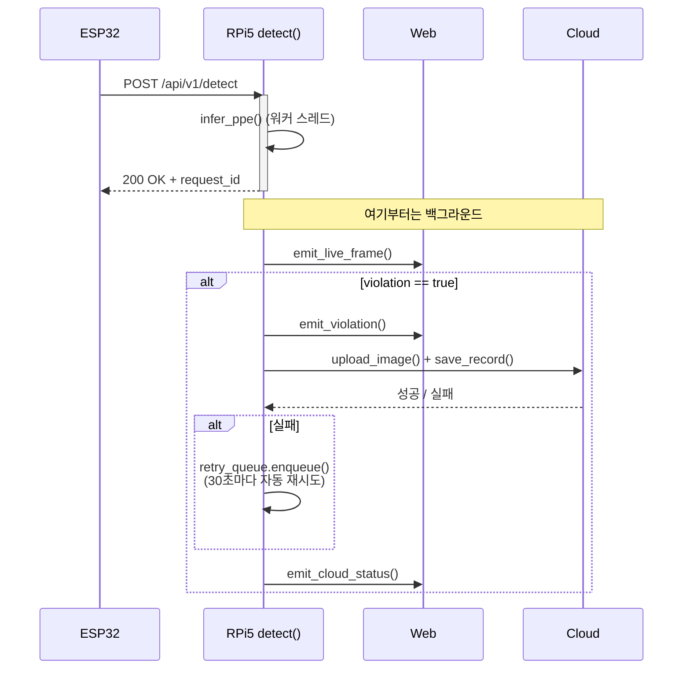

# PPE 안전 모니터링 시스템

[](https://github.com/iamstar2/pr6/actions/workflows/ci.yml)

ESP32-S3 카메라가 사람을 감지하면, Raspberry Pi 5가 헬멧/안전조끼 착용 여부를 판별하고,
위반 시 클라우드에 증거를 저장하면서 웹 대시보드에 실시간으로 알립니다.

- **①ESP32-S3** — Edge Impulse FOMO 모델로 사람 감지 + 캡처 (`esp32/`)
- **②RPi5** — ONNX YOLOv8n으로 PPE(헬멧/조끼) 판별 (`rpi5/`)
- **③Cloud** — 위반 이미지/기록 저장, Provider 추상화 (`cloud/`)
- **④Web** — Next.js + Socket.IO 실시간 대시보드 (`web/`)

---

## 파이프라인



RPi5는 ESP32에 **즉시 응답**하고, 웹/클라우드로의 전송은 백그라운드(`asyncio.create_task`)에서 계속됩니다 —
카메라 노드가 느린 업로드 때문에 대기하지 않도록 하기 위한 설계입니다.



더 자세한 함수·파일 단위 트레이스와 데이터 저장 위치는 팀 내부 문서를 참고하세요.

---

## 실무화 하드닝 — 5개 항목

PoC를 프로덕션 수준으로 끌어올리며 개선한 내용입니다. 상세 Before/After는
[`report.md`](report.md), 사전 점검 리포트는 [`HARDENING_REPORT.md`](HARDENING_REPORT.md) 참고.

### 1. 파라미터화 및 가독성
하드코딩되어 있던 시크릿/URL/임계값/타임아웃을 `.env`·`config.yaml`·`config.h`로 전부 분리했습니다
(`DEVICE_API_KEY`, `MAX_UPLOAD_BYTES`, `WEB_INGRESS_TOKEN`, `RETRY_*`, `ENV`, `LOG_*` 등 14개 신규).
`rpi5/app/config.py`는 환경변수를 **매 호출마다 다시 읽도록**(`_env_overrides()`) 재설계해서,
`ENV=development/staging/production`으로 로그 레벨 등 배포 프로파일이 실제로 전환되게 만들었습니다.

### 2. 예외 처리 및 안정성
- **보안**: `device_id` 경로 조작(Path Traversal) 취약점을 화이트리스트 검증(`app/security.py`)
  + 방어적 이중 검증(`cloud/providers/local_mock.py`)으로 수정. `X-API-Key`/`X-Internal-Token` 인증,
  업로드 크기·Content-Type 검증 추가.
- **Graceful Degradation**: 클라우드 업로드 실패 시 이미지+기록을 로컬 디스크에 큐잉하고 30초마다
  백그라운드로 자동 재시도(`app/retry_queue.py`) — 클라우드가 죽어도 감지 파이프라인은 무중단.
- **ESP32**: 카메라/버퍼 초기화 실패 시 무한정지 대신 `esp_restart()` 자동 복구, 태스크 워치독(40s) 추가.

### 3. 성능 및 메모리 관리
ONNX 추론(`infer_ppe`)을 `asyncio.to_thread`로 워커 스레드에 오프로드해, 무거운 추론 중에도
FastAPI 이벤트 루프가 다른 요청/헬스체크를 계속 처리할 수 있도록 했습니다.

### 4. 로깅
3개 언어 모두 구조화 로깅을 도입했습니다.
| | Before | After |
|---|---|---|
| RPi5 (Python) | `basicConfig` 한 줄 | `dictConfig` + `RotatingFileHandler`(10MB×5, 상한 60MB) + `file:line` + 중앙 로그 수집 훅 |
| Web (Node) | `console.log` 산발 | JSON 라인 로거(`lib/logger.js`) |
| ESP32 (C++) | `Serial.print` 산발 | 컴파일타임 `LOGE`/`LOGI`/`LOGD` 매크로 (`LOG_LEVEL`) |

### 5. CI/CD 자동화
GitHub Actions 4단계 파이프라인(`.github/workflows/ci.yml`): `Lint → Pytest(Unit→Integration) → Web 빌드 →
(main push만) Docker 빌드`. `needs:`로 앞 단계 실패 시 뒤 단계는 **skip** — 검증 안 된 코드는 빌드 단계에
도달조차 못 합니다. RPi5용 pytest 36개(단위/통합 분리, 외부 의존성 mock)를 새로 작성했습니다.

---

## 폴더 구조

```
esp32/    ESP32-S3 펌웨어 (PlatformIO)
rpi5/     PPE 판별 FastAPI 서버 (ONNX Runtime)
cloud/    클라우드 저장 Provider 추상화
web/      Next.js 실시간 대시보드
```

## 시작하기

- **ESP32**: `esp32/include/config.h.example`를 `config.h`로 복사 후 값 채우기 → PlatformIO로 빌드/업로드
- **RPi5**: `cd rpi5 && cp .env.example .env && pip install -r requirements.txt && PYTHONPATH=.. uvicorn app.main:app --reload`
- **Web**: `cd web && cp .env.example .env && npm install && npm run dev`

각 모듈별 상세 실행법은 [`rpi5/README.md`](rpi5/README.md), [`web/README.md`](web/README.md) 참고.
컴포넌트 간 통신 계약(요청/응답 필드, 인증 헤더)은 [`INTEGRATION.md`](INTEGRATION.md)에 정리되어 있습니다.

## 테스트

```bash
cd rpi5
pip install -r requirements-dev.txt
pytest              # 단위 + 통합 36개
ruff check .        # lint
```

push하면 위 CI 배지에 표시되는 GitHub Actions가 자동으로 같은 걸 실행합니다.
